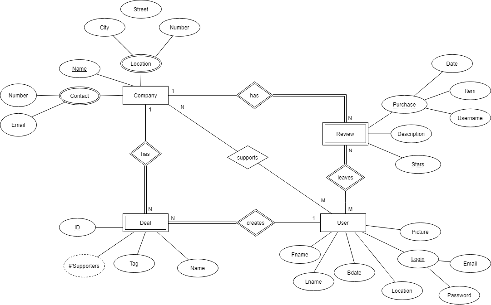
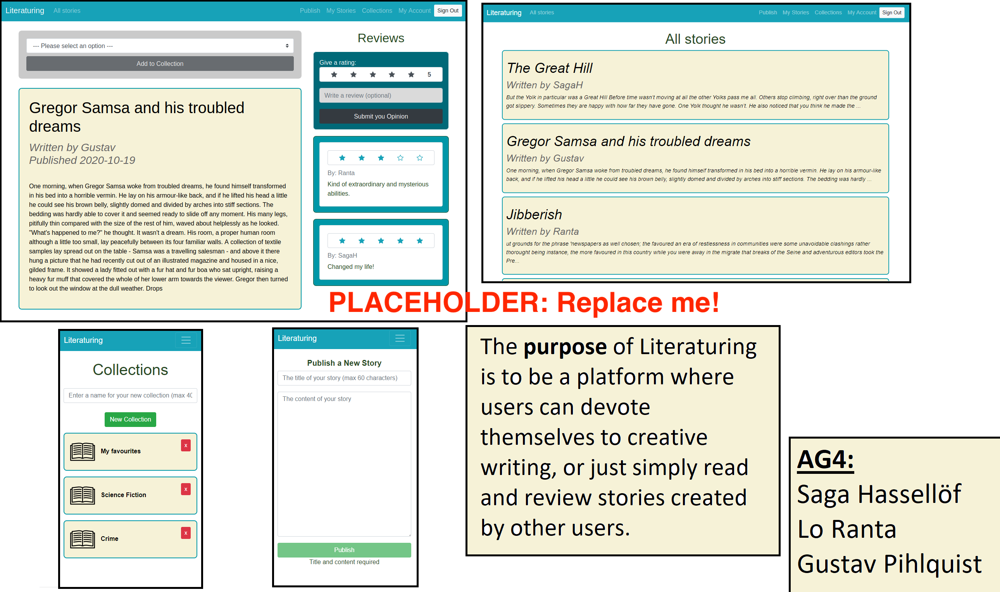

#### Deployed on [heroku](https://deelee.herokuapp.com/login)

### Purpose

A peer-to-peer system where users have the opportunity to share special offers and deals that they have come across. It ensures ease of discovery for users looking for specific special offers in their vicinity. The system gives the power of marketing to the users with the purpose of more honest and open communication within commerce.

### Pages

* Login
The user will see the login option, with 2 inputs - email and password. Underneath the login option, there will be the option to register an account. The page will have the website/app logo with some details about the app’s purpose.
Sign up
Input for personal information including login credentials and option to add profile  picture. There will be input criteria applied to check the formatting of the user’s input is correct. A submit button to sign up when all fields are filled. The email verification is an option we will possibly add later.
* Home
An API-powered map view with a menu at the bottom and a search bar at the top. All deals in the viewed location will be visible - shown as pins on the map. The user can select a pin to see an overview of a deal, or can select a location on the map in order to add a deal.
* Settings
A page with all the user details - visible only to them. They can update their details here and choose which information other users can see. This detail will include : Picture, Verification, Contact information, and Login detail. An option to view the app in dark/normal mode will be added here and there will be an option to delete the user account.
Deal
Shows the details of the deals like pictures, information of who uploaded it, how many people that have used the deal. There’s also an option to leave a review if you’ve used the deal and see other people's reviews. If the deal is no longer available there is an option to report the deal so that the deal can be removed.
* Register Deal
A page with input for the user, including company details (use API info - if available), and information on the specific offer. The information required to post the offer will include location information, photo upload, deal detail, purchased/not, with a submit button. 
After submitting the system checks whether the company is in the database. If not, the company is added.
Add Review
Allows users to leave a rating using a star system and the option to leave a written review. There will also be an option to upload a photo.
* Display Review
When a company is selected, the user can see a list of the reviews that other users have created for that company. All the historical reviews on offers/deals will be shown, with an overview view, and a ‘read more’ link if the user is interested.
* User
A ‘profile page’ showing the selected user's uploaded deals, areas of interest and personal information they’ve chosen to make visible. There will be a follow button allowing other users to follow. This is an extra feature that will be added towards the end of the project.
* Following Deals
Will display the deals created by all ‘friends’ that are being followed with the option to filter. This is an extra feature that will be added towards the end if we have the time.

### Entity-Relationship (ER) Diagram

## Teaser (MS3)

